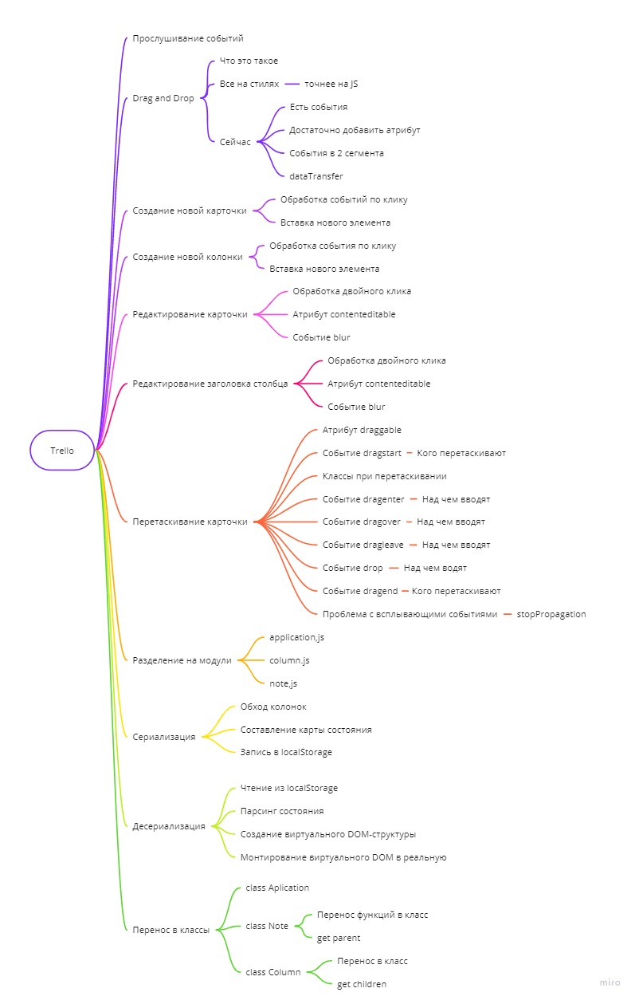

# My Trello clone

*If you need to organize or plan something, Trello has you covered.*

>Using Trello to Organize Your Entire Life

*Trello is an online app for organizing your to-do list, your schedule, projects, meal planning, ideas…and this list could go on and on.*
*It’s like a bulletin board with a bunch of post-it notes you can move around…but it’s digital!*

### Technologies used in the project:

* HTML5
* CSS3, Sass
* JavaScript, ES6
* Git, GitHub

